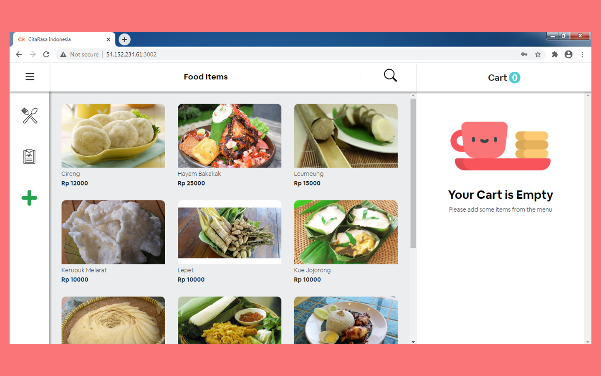

# CitaRasa Web 

<div align="center">
    
</div>

## Contents

- [Description](#description)
- [Features](#features)
- [Requirements](#requirements-for-development)
- [Installation](#installation-for-development)
- [Screenshoots](#screenshoots)
- [Demo CitaRasa Web](#demo-citarasa-web)
- [Related Project](#related-project)

## Description

**CitaRasa Web** is a web-based point of sale application that sells Indonesian
specialties, there are 2 user levels, namely admin and cashier. Cashier can only
log in and make transactions according to buyer's order, while admins can
register new cashiers or admins through the application.

## Features

- Order food
- Add food product (admin only)
- Add cashier or admin (admin only)
- History transaction

## Requirements for Development

- [`Node Js`](https://nodejs.org/en/)
- [`npm`](https://www.npmjs.com/get-npm)
- [`ReactJs`](https://reactjs.org/)
- [`CitaRasa Backend`](https://github.com/solehudin5699/POS-back-end.git)

## Installation for Development

1. Open your terminal or command prompt
2. Type `git clone https://github.com/solehudin5699/POS-frontend.git`
3. Open the folder and type `npm install` for install dependencies
4. Create file **_.env_** in root directory with the following contents :

```bash
REACT_APP_API_URL ="URL_for_CitaRasa_backend"
```

Example :

```bash
REACT_APP_API_URL ="http://localhost:8000"
```

5. Before run this, you must installation backend and then run backend
6. Type `npm start` in terminal for running this project.
7. If you want to build, type `npm run build`.

## Screenshoots

<div align="center">
    
</div>

## Demo CitaRasa Web

Try this CitaRasa Web build version, use username "cashierdemo" , password
"cashierdemo", and login as cashier for trying it.

<a href="http://54.152.234.61:3002">
  
</a>

## Related Project

<a href="https://github.com/solehudin5699/POS-back-end.git">

</a>
